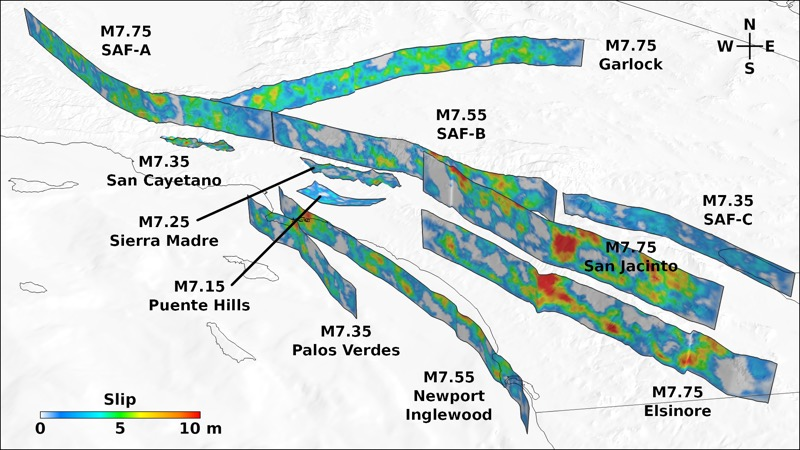
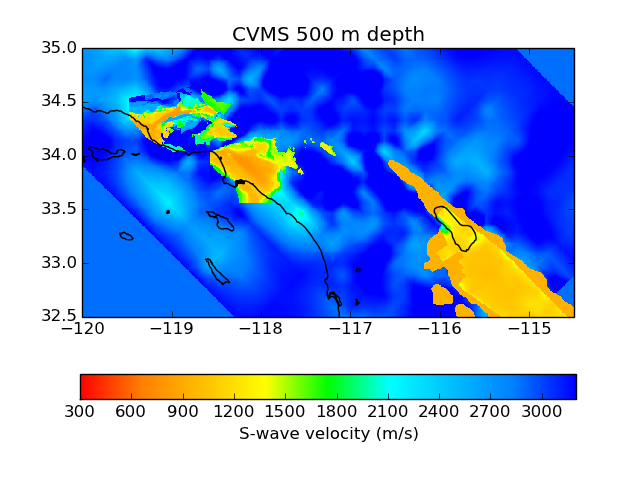
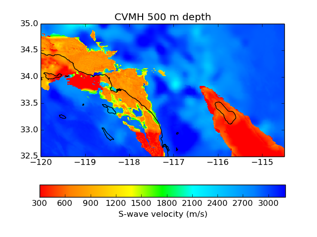
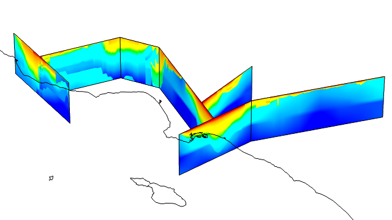
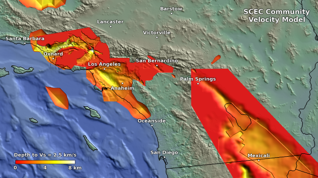

# COSEIS

## Computational Seismology Tools

[github.com/gely/coseis](https://github.com/gely/coseis/)  
[elygeo.net/coseis](http://elygeo.net/coseis/)  

## Summary

Coseis is a toolkit for earthquake simulation featuring:

- The Support Operator Rupture Dynamics ([SORD](http://elygeo.net/sord.html))
  code for modeling spontaneous rupture and 3D wave propagation.

- SCEC Community Velocity Models (CVM) codes, with MPI parallelization for
  [Magistrale version](https://scec.usc.edu/scecpedia/CVM-S4) (CVM-S), and new
  [geotechnical layer implementation](http://elygeo.net/2016-Vs30GTL-Ely+4.html)
  for the [Harvard version](http://scec.usc.edu/scecpedia/CVM-H) (CVM-H).

- Utilities for mesh generation, coordinate projection, and visualization.

The primary interface is through a Python module which (for high-performance
components) wraps Fortran parallelized with hybrid OpenMP and MPI.

Coseis is written by [Geoffrey Ely](http://elygeo.net/) with contributions from
Steven Day, Bernard Minster, Feng Wang, Zheqiang Shi, and Jun Zhou.  It is
licensed under [BSD](http://opensource.org/licenses/BSD-2-Clause) terms.

**WARNING**: Coseis is a research code under active development. Changes are
frequent and it has known bugs! The latest committed version may not be your
best option or even working. Please contact me for guidance.

## Install

For MacOS only, install
[Xcode](http://itunes.apple.com/us/app/xcode/id497799835) from the App Store
followed by the Xcode the Command Line Tools with:

    xcode-select --install

For MacOS only, install [Homebrew](http://brew.sh/) and use it to install
[Fortran](http://r.research.att.com/tools/) with:

    brew install gfortran

Clone the source code from the [Coseis GitHub
repository](http://github.com/gely/coseis):

    git clone git://github.com/gely/coseis.git

Setup python to be able to find the `cst` package:

    cd coseis
    python -m cst setup

## Test

To run the test suite interactively:

    cd tests
    python test_runner.py --run=exec

Or, submit a job for batch processing:

    python test_runner.py --run=submit

After completion, a report is printed to the screen (or saved in
`run/test_suite/test_suite.output`):

    PASSED: cst.tests.hello_mpi.test()
    PASSED: cst.tests.point_source.test()
    PASSED: cst.tests.pml_boundary.test()
    PASSED: cst.tests.kostrov.test()

## Examples

### CVM depth plane

Extract S-wave velocity at 500 meters depth. Plot using Matplotlib:

[CVM-Slice.py](scripts/CVM-Slice.py)

### CVM-S fence diagram

Build a fence diagram similar to Magistrale (2000) figure 10. Plot using
Mayavi

[CVM-Fence.py](scripts/CVM-Fence.py)

### CVM-S basin depth

Extract 3D mesh and search for the shallowest surface of Vs = 2.5 km/s. Plot
over topography using Mayavi.

[CVM-Basins-mesh.py](scripts/CVM-Basins-mesh.py)  
[CVM-Basins-search.py](scripts/CVM-Basins-search.py)  
[CVM-Basins-plot.py](scripts/CVM-Basins-plot.py)  

